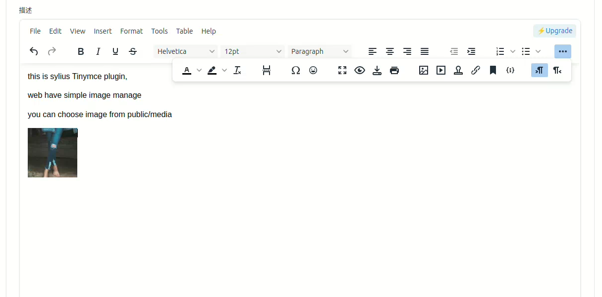
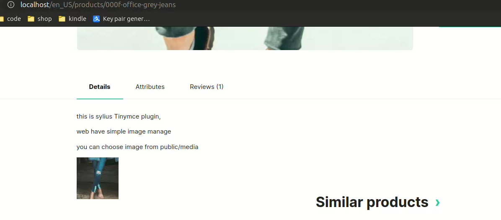

### Sylius Tinymce plugin

## Description
#### Use tinymce edit product description and short_description

### version 1.0.0
#### this is first version
#### i am sylius plugin beginner, so make sure install on your dev environment test first
#### If you can point out any errors in my code or suggest a better way, please leave a comment.

## Screenshots



## Installation
1. Run `composer require jinber/sylius-tinymce-plugin`

2. Enable the plugin in bundles.php

```php
<?php
// config/bundles.php

return [
    // ...
    Jinber\SyliusTinymcePlugin\JinberSyliusTinymcePlugin::class => ['all' => true],
];
```

3. Import the plugin configurations

```yml
# config/packages/_sylius.yaml
imports:
    # ...
    - { resource: '@JinberSyliusTinymcePlugin/config/config.yaml' }
```

4. Add the shop and admin routes

```yml
# config/routes.yaml
sylius_jinber_tinymce_admin:
    resource: '@JinberSyliusTinymcePlugin/config/routes/admin_route.yaml'
    prefix: '/admin'
```
5. installing assets

```
php bin/console assets:install
php bin/console cache:clear
```

## Buy me coffee
[](https://www.paypal.me/jinbercom)
